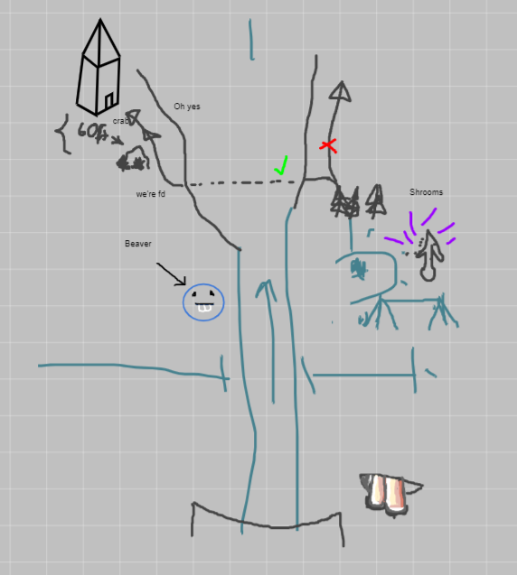

# Session 1

## Locations:
- [ ] Greenhill
- [ ] Copper

## General Notes:
* Bemvir and Ellisar looking for rumors.
* Genasi mage/human apprentice at edge of town
* Guy who has gotten robbed multiple times
* Rumor: River, running through forest to Greenhill. River is running dry, water level dropped by meters.
* Ruined tower
* Tavern Greenhill: bed for 5s/night

## What we have done/seen:
1. Met at a bar, scruffy dud at bar (Alma) looking sus, inviting him to join the table and Bemvir baught food.
2. We head to ruined tower, stop at the alchemy store and met the fire genasi and human. Got a bottle of firebreath.
3. Walked through the river, saw footprints leading into the forest
4. Dam built in the river, creatures on it (size of a bear, 4x Dire Beavers)
5. We sneak around the dam trying to avoid the beavers
6. Avital got shot in the back, 2x hobgoblin, 4x goblin
7. Combat with the hob and goblins by the dam
8. We killed the enemies but one hobgoblin who dashed away and would never be seen again. (Hopefully)
9. Bemvir licked mushrooms and rolled a d100 (39), WTF
10. Bemvir regained 19hp from the mushroom.
11. I licked one too, feeling gooooooood.
12. SLEEP in the mushroom pit
13. Wyvern (Thought to be) flied NE of the mushroom pit during the night
14. Me and Bemvir shrunk from the mushrooms, going on the height of halflings. (Or everyone else grew and we where not effected...)
15. Avital threw spear at door on tower, door open

## Personal Aspirations: (**Adar Dens'**)
### Short term aspirations
- [x] Get Ellisar away from a dangerous situation unharmed (Combat)
- [ ] Get a better bow
- [ ] Fabricate/acquire blackmail material on local nobles

### Long term aspirations
- [ ] Use said blackmail material for personal gain or to benefit the party
- [ ] Get a infamous title/nickname in the region